# Seed Tree

## Purpose

This tree gives the growing concept seed collection a navigable shape.

The [[Concept Ledger]] tracks admitted concept identities. This seed tree tracks the current seed documents as a human and Obsidian navigation surface, so the vault is not only a flat list of Markdown files.

Graph links worth following: [[Concept]], [[Semantic Hub]], [[Relation]], [[Relation Tuple]], [[Concept Ledger]], [[Relation Predicate Concept Ledger]], [[Semantic Neighborhood]], and [[Index]].

## Tree View

```text
concept seeds
  -> root orientation
     -> concept
     -> semantic_hub
     -> semantic_neighborhood
  -> form primitives
     -> capacity
     -> boundary
     -> substrate
     -> activation
     -> direction
  -> vault governance
     -> ledger
     -> inventory
     -> seed
     -> discipline
     -> relation
     -> relation_tuple
     -> source_structure
     -> open_question
     -> index
  -> navigation grammar
     -> follow_up_link
     -> link_quality
     -> concept_trail
     -> discovery_path
  -> process grammar
     -> process_shape
  -> relation predicates
     -> is_a
     -> within
     -> associated_with
     -> uses
     -> requires
     -> enables
     -> confused_with
  -> computing domain
     -> computing
     -> computer_science
     -> information_technology
     -> algorithm
     -> data_structure
     -> computer_programming
     -> operating_system
     -> computer_network
     -> database_management_system
     -> distributed_computing
```

## Active Obsidian Tree

| Tree branch | Seed documents | Role |
| --- | --- | --- |
| `root-orientation/` | [[Concept]], [[Semantic Hub]], [[Semantic Neighborhood]] | Central pages that orient the concept layer |
| `form-primitives/` | [[Capacity]], [[Boundary]], [[Substrate]], [[Activation]], [[Direction]] | Foundational form concepts already used across the Seed Vault |
| `vault-governance/` | [[Ledger]], [[Inventory]], [[Seed]], [[Discipline]], [[Relation]], [[Relation Tuple]], [[Source Structure]], [[Open Question]], [[Index]] | Concepts that govern how ontology material is gathered, represented, and reviewed |
| `navigation-grammar/` | [[Follow-Up Link]], [[Link Quality]], [[Concept Trail]], [[Discovery Path]] | Concepts that make Obsidian traversal intentional |
| `process-grammar/` | [[Process Shape]] | Concepts that make process structure graph-ready |
| `relation-predicates/` | [[is_a]], [[within]], [[associated_with]], [[uses]], [[requires]], [[enables]], [[confused_with]] | Predicate concepts used as active relation edges |
| `computing-domain/` | [[Computing]], [[Computer Science]], [[Information Technology]], [[Algorithm]], [[Data Structure]], [[Computer Programming]], [[Operating System]], [[Computer Network]], [[Database Management System]], [[Distributed Computing]] | First science-and-technology domain expansion |

## Mermaid View

```mermaid
flowchart TD
  Seeds["Concept Seeds"]
  Seeds --> Root["Root Orientation"]
  Root --> Concept["[[Concept]]"]
  Root --> SemanticHub["[[Semantic Hub]]"]
  Root --> SemanticNeighborhood["[[Semantic Neighborhood]]"]

  Seeds --> FormPrimitives["Form Primitives"]
  FormPrimitives --> Capacity["[[Capacity]]"]
  FormPrimitives --> Boundary["[[Boundary]]"]
  FormPrimitives --> Substrate["[[Substrate]]"]
  FormPrimitives --> Activation["[[Activation]]"]
  FormPrimitives --> Direction["[[Direction]]"]

  Seeds --> Governance["Vault Governance"]
  Governance --> Ledger["[[Ledger]]"]
  Governance --> Inventory["[[Inventory]]"]
  Governance --> Seed["[[Seed]]"]
  Governance --> Discipline["[[Discipline]]"]
  Governance --> Relation["[[Relation]]"]
  Governance --> RelationTuple["[[Relation Tuple]]"]
  Governance --> SourceStructure["[[Source Structure]]"]
  Governance --> OpenQuestion["[[Open Question]]"]
  Governance --> Index["[[Index]]"]

  Seeds --> Navigation["Navigation Grammar"]
  Navigation --> FollowUpLink["[[Follow-Up Link]]"]
  Navigation --> LinkQuality["[[Link Quality]]"]
  Navigation --> ConceptTrail["[[Concept Trail]]"]
  Navigation --> DiscoveryPath["[[Discovery Path]]"]

  Seeds --> Process["Process Grammar"]
  Process --> ProcessShape["[[Process Shape]]"]

  Seeds --> Predicates["Relation Predicates"]
  Predicates --> IsA["[[is_a]]"]
  Predicates --> Within["[[within]]"]
  Predicates --> AssociatedWith["[[associated_with]]"]
  Predicates --> Uses["[[uses]]"]
  Predicates --> Requires["[[requires]]"]
  Predicates --> Enables["[[enables]]"]
  Predicates --> ConfusedWith["[[confused_with]]"]

  Seeds --> ComputingDomain["Computing Domain"]
  ComputingDomain --> Computing["[[Computing]]"]
  ComputingDomain --> ComputerScience["[[Computer Science]]"]
  ComputingDomain --> InformationTechnology["[[Information Technology]]"]
  ComputingDomain --> Algorithm["[[Algorithm]]"]
  ComputingDomain --> DataStructure["[[Data Structure]]"]
  ComputingDomain --> ComputerProgramming["[[Computer Programming]]"]
  ComputingDomain --> OperatingSystem["[[Operating System]]"]
  ComputingDomain --> ComputerNetwork["[[Computer Network]]"]
  ComputingDomain --> DatabaseManagementSystem["[[Database Management System]]"]
  ComputingDomain --> DistributedComputing["[[Distributed Computing]]"]
```



## Growth Rule

When adding a new seed:

1. add the seed to the narrowest useful tree branch;
2. add the seed to the README if it is public and current;
3. add the concept to the relevant ledger or subledger;
4. update concept counts if the seed is admitted;
5. prefer splitting a tree branch before it becomes a flat bucket.

## Open Questions

- Should relation predicate seeds eventually move under their own folder instead of sharing `seeds/`?
- Should the tree distinguish public ontology seeds from local planning-only candidates?
- Should each branch get its own branch hub once it grows beyond 12 seeds?
